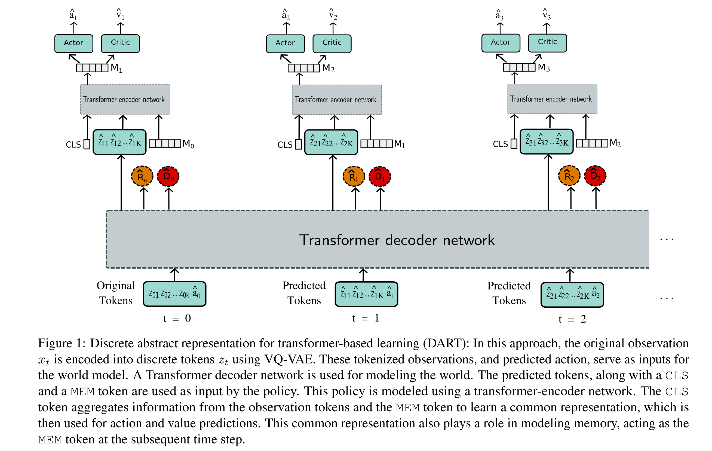

# DART (Full code to be released soon)
---
Official implementation of ICML 2024 paper "Learning to Play Atari in a World of Tokens" by  

[Pranav Agarwal](https://pranaval.github.io/), [Sheldon Andrews](https://profs.etsmtl.ca/sandrews/) and [Samira Ebrahimi Kahou](https://saebrahimi.github.io/). 

In this work, we introduce discrete abstract representations for transformer-based learning (DART), a sample-efficient method utilizing discrete representations for modeling both the world and learning behavior. DART outperforms previous state-of-the-art methods that do not use look-ahead search on the Atari 100k sample efficiency benchmark with a median human-normalized score of 0.790 and beats humans in 9 out of 26 games.

[Paper]()  [Webpage](https://pranaval.github.io/DART/)

<p align="center">
  
</p>

---
### Dependencies
Create a virtual environment and install all the required files
```
python3.8 -m venv myenv
source myenv/bin/activate
pip install -r requirements.txt
```


